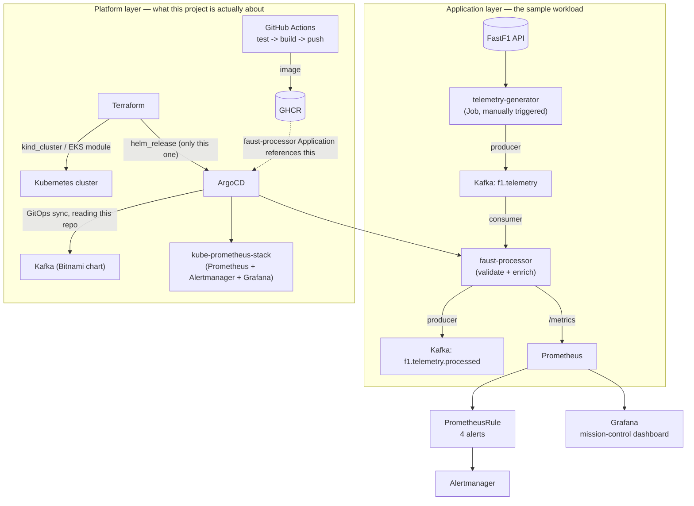

# Architecture

This is the current, as-built architecture — not the original plan. Where
the two differ (they do, in a few places), this document says so and why.
For the day-by-day story of how it got here, see
[progress-log.md](progress-log.md). For background on the project's goals
and the original technical decisions, see [CLAUDE.md](../CLAUDE.md).

## Two layers

**Application layer**: the F1 telemetry pipeline. This is the sample
workload — deliberately "good enough," not the point of the project (see
CLAUDE.md's priority principle).

**Platform layer**: everything that builds, deploys, and operates the
application layer. This is what the project is actually about, and where
most of the engineering effort went.

## The Terraform / ArgoCD boundary

This is the single most important structural decision in the repo, and it
wasn't the original plan — an earlier version of this project had Terraform
directly own Kafka and faust-processor via `helm_release` resources. That
broke once ArgoCD was introduced (Week 2, Day 8-9): Terraform and ArgoCD are
both *continuous reconciliation* tools — each maintains its own belief about
what a resource should look like and keeps correcting drift back toward it.
Point both at the same Kubernetes objects and they fight: Terraform's next
`apply` pulls a resource back toward what's in its state file, ArgoCD's
self-heal pulls it back toward what's in git, and there is no stable
equilibrium.

The fix was to give each tool a non-overlapping domain instead of trying to
coordinate between them:

| | Terraform | ArgoCD |
|---|---|---|
| Owns | The cluster itself (`kind_cluster` / EKS module) + installing ArgoCD | Everything that runs *on* the cluster |
| Source of truth | Local `.tf` state | This git repo (`infra/argocd/`, `infra/helm/`) |
| Changes when | You run `terraform apply` | You push to `main` (auto-synced, no manual step) |

`telemetry-generator` sits outside *both* — it's a run-to-completion `Job`,
and neither tool's continuous-reconciliation model fits a "run once, exit"
workload well (re-syncing the same Job spec doesn't trigger a new run).
It's triggered manually: `helm install --generate-name infra/helm/
telemetry-generator -n pipeline`.

## Data flow

1. **`telemetry-generator`** replays a historical FastF1 session onto
   `f1.telemetry`, paced by a configurable speed multiplier, with optional
   fault injection (out-of-range values, delayed delivery) — see
   [apps/telemetry-generator/README.md](../apps/telemetry-generator/README.md).
2. **`faust-processor`** consumes that topic, validates each record against
   plausibility bounds, computes two derived features (speed delta,
   out-of-order detection), and republishes to `f1.telemetry.processed` —
   see [apps/faust-processor/README.md](../apps/faust-processor/README.md).
3. In parallel, `faust-processor` exposes two *independent* outputs (not a
   pipeline stage) — see the "常见误区" / misconceptions in the personal
   glossary for the full explanation of why these are parallel, not
   sequential:
   - **Kafka topic** (`f1.telemetry.processed`): full-detail event history
   - **Prometheus metrics** (`/metrics`, scraped via its own `ServiceMonitor`):
     pipeline-health counters/histogram (records processed, validation
     failures, out-of-order events, processing lag) plus four Gauges for
     live per-driver telemetry (speed/throttle/RPM/gear) that back the
     Grafana dashboard's "mission control" panels
4. **Prometheus** scrapes those metrics and evaluates four alert rules
   (`PrometheusRule`, shipped as part of faust-processor's own chart —
   the service owns its own alerting contract rather than having it bolted
   on externally): high invalid-record rate, out-of-order data, pipeline
   stalled, high p95 processing lag.
5. **Alertmanager** receives firing alerts (no real notification receiver
   wired up — this demonstrates the rules and firing mechanism; adding a
   Slack/PagerDuty receiver is a small, separate step).
6. **Grafana** renders a 12-panel dashboard sourced from the same Prometheus
   metrics, shipped as a ConfigMap (`grafana_dashboard: "1"` label) that
   kube-prometheus-stack's sidecar auto-discovers — no manual dashboard
   import.

## What's deliberately not built (yet)

- **Loki** (log aggregation): part of the original architecture sketch, but
  never made it onto the concrete day-by-day timeline and isn't built. The
  observability stack that exists is Prometheus + Alertmanager + Grafana
  (metrics/alerts/dashboards), not logs.
- **`apps/mcp-copilot`**: a Claude Code skill / MCP server for natural-
  language queries against pipeline health — planned, not started.
- **Real AWS EKS deployment**: the `infra/terraform/envs/aws-eks` +
  `infra/terraform/modules/{vpc,eks,iam}` code is written and validated
  against the real Terraform registry modules, but has never been applied —
  any operation that would incur real cloud cost requires explicit sign-off
  first (see CLAUDE.md).
